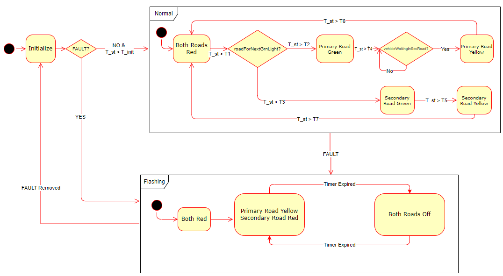
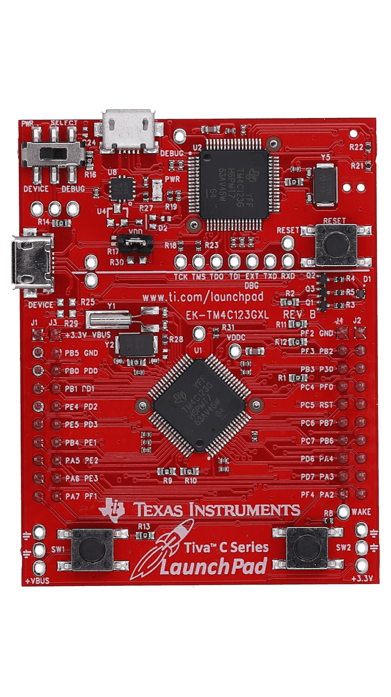

<!-- 
*** This file was adapted from Best-README-Template by [othneildrew] (https://github.com/othneildrew/Best-README-Template)
*** Licensed under the MIT License
-->

<!-- PROJECT SHIELDS -->
<!--
*** I'm using markdown "reference style" links for readability.
*** Reference links are enclosed in brackets [ ] instead of parentheses ( ).
*** See the bottom of this document for the declaration of the reference variables
*** for contributors-url, forks-url, etc. This is an optional, concise syntax you may use.
*** https://www.markdownguide.org/basic-syntax/#reference-style-links
-->

<!-- PROJECT LOGO -->
 

  

  <h3 align="center">Traffic Light System</h3>

  

    The Traffic Light System project implements a standard traffic light sequence using the Tiva C Launchpad. This project aims to demonstrate basic embedded system concepts, including timing, state machines, and GPIO control. It serves as an educational tool for understanding how microcontrollers can be used to control hardware components like LEDs in a real-world application. The system cycles through red, yellow, and green lights, mimicking the operation of a real traffic signal.
     
  

<!-- TABLE OF CONTENTS -->

  
Table of Contents

  <ol>
    <li>
      <a href="#system-design">System Design</a>
    </li>
    <li>
      <a href="#embedded-platforms">Embedded Platforms</a>
      <ul>
        <li><a href="#tiva-c-series-launchpad">Tiva C Series LaunchPad</a></li>
      </ul>
    </li>
    <li><a href="#license">License</a></li>
  </ol>

<!-- System Design -->
## System Design

This state machine diagram represents the operation of a traffic light control system, managing the signal flow for two intersecting roads, referred to as the "Primary Road" and "Secondary Road." The system transitions through various states to control the timing of traffic signals. Below is an explanation of each state and the transitions:

### Initialize:
   - This is the starting state where the system initializes. The transition from this state occurs when the initialization timer (`T_st > T_init`) completes.
   - In the `Initialize` state, the `roadForNextGrnLight` parameter is set to designate the primary road as the next to receive a green light.

### Normal Operating Mode
   1. ***Both Roads Red:***
   - After initialization, the system enters a state where both roads display a red light. This state is a buffer period to ensure both roads stop before allowing any road to go green.
   - The system remains in this state until a timer (`T_st > T1`) triggers the next transition. 
   2. ***Decision Node - `roadForNextGrnLight?`:***
   - The system checks which road should receive the green light next.
   - If the primary road is selected (`T_st > T2`), it transitions to the "Primary Road Green" state.
   - If the secondary road is selected (`T_st > T3`), it transitions to the "Secondary Road Green" state.

   3. ***Primary Road Green:***
   - In this state, the primary road displays a green light, allowing traffic to flow.
   - After the green light timer (`T_st > T4`) expires, the system transitions to "Primary Road Yellow" only if a sensor on the secondary road indicates that a vehicle is waiting. 
   - Additionally, upon entering the `Primary Road Green` state, the `roadForNextGrnLight` parameter is set to designate the secondary road as the next to receive a green light.

   4. ***Primary Road Yellow:***
   - The primary road's light changes to yellow, warning that the signal will soon turn red.
   - Once the yellow light timer (`T_st > T6`) expires, the system returns to the "Both Roads Red" state.

   5. ***Secondary Road Green:***
   - Here, the secondary road receives a green light, permitting traffic to flow.
   - After the green light timer (`T_st > T5`) ends, the system moves to "Secondary Road Yellow."
   - Upon entering the `Secondary Road Green` state, the `roadForNextGrnLight` parameter is set to designate the primary road as the next to receive a green light.

   6. ***Secondary Road Yellow:***
   - The secondary road's light switches to yellow, signaling the end of the green light period.
   - Once the yellow light timer (`T_st > T7`) completes, the system transitions back to the "Both Roads Red" state.

### Flashing Operating Mode
1. ***Both Roads Red:***
   - When a fault is detected by the system in any state the state machine transitions to operating in flashing mode. After the initial detection of the fault both roads display the red light. After a timer expires the state transitions to 
2. ***Primary Road Yellow and Secondary Road Red:***
   - In this state the primary road displays the yellow light and the secondary road displays the red light. In combination with ***Both Roads Off*** state the traffic signal displays a caution to the primary road and acts as a stop sign for the secondary road. Once the timer expires the sub-state machine transitions to the ***Both Roads Off*** state.
3. ***Both Roads Off:***
  - In this state the both primary and secondary road lights are switched off. In combination with ***Primary Road Yellow and Secondary Road Red*** state the traffic signal displays a caution to the primary road and acts as a stop sign for the secondary road. Once the timer expires the sub-state machine transitions to the ***Primary Road Yellow and Secondary Road Red*** state.

If the sensor detects that the fault has been removed the supervisory state machine transitions back to the ***Initialize*** state.

### Flow Summary:
- The system cycles through these states, alternating between allowing the primary and secondary roads to move.
- Timers control the duration of each state, with priority given to the primary road during normal operation. The primary road remains in the green state after the timer expires, unless a vehicle is detected waiting at the lights on the secondary road.
- After each yellow light, the system ensures both roads are red before allowing the next green light.
- Finally, a fault mode is implemented to exert a caution on the primary road and a stop sign on the secondary mode to ensure driver safety during a faulted condition.

This state machine ensures a safe and orderly flow of traffic at the intersection by systematically controlling the timing of the traffic lights for both roads.

(<a href="#readme-top">back to top</a>)

## Embedded Platforms

### Tiva C Series LaunchPad:

The state machine was implemented on the Tiva C Launchpad using [Code Composer Studio](https://www.ti.com/tool/CCSTUDIO) (CCS) version 12.7.1 with the GNU compiler (v9.2.1 Linaro). The implementation leverages startup code provided by [Quantum Leaps](https://www.state-machine.com/video-course) and CMSIS v5.0.1, ensuring a robust and efficient control system for the traffic light application.

The CCS project and all project code can be found in the [trafficLightSystem](./Tiva_C_Launchpad/trafficLightSystem/) folder .

### Basys 3 :

The state machine was implemented on the Artix-7 FPGA development board using [Vivado](https://www.xilinx.com/products/design-tools/vivado.html) version 2024.1.

The vivado project and all project verilog code can be found in the [Basys3](./Basys3) folder .

(<a href="#readme-top">back to top</a>)

<!-- LICENSE -->
## License

Distributed under the MIT License. See `LICENSE.txt` for more information.

(<a href="#readme-top">back to top</a>)

<!-- MARKDOWN LINKS & IMAGES -->
<!-- https://www.markdownguide.org/basic-syntax/#reference-style-links -->
[contributors-shield]: https://img.shields.io/github/contributors/othneildrew/Best-README-Template.svg?style=for-the-badge
[contributors-url]: https://github.com/othneildrew/Best-README-Template/graphs/contributors
[forks-shield]: https://img.shields.io/github/forks/othneildrew/Best-README-Template.svg?style=for-the-badge
[forks-url]: https://github.com/othneildrew/Best-README-Template/network/members
[stars-shield]: https://img.shields.io/github/stars/othneildrew/Best-README-Template.svg?style=for-the-badge
[stars-url]: https://github.com/othneildrew/Best-README-Template/stargazers
[issues-shield]: https://img.shields.io/github/issues/othneildrew/Best-README-Template.svg?style=for-the-badge
[issues-url]: https://github.com/othneildrew/Best-README-Template/issues
[license-shield]: https://img.shields.io/github/license/othneildrew/Best-README-Template.svg?style=for-the-badge
[license-url]: https://github.com/othneildrew/Best-README-Template/blob/master/LICENSE.txt
[linkedin-shield]: https://i.sstatic.net/gVE0j.png
[linkedin-url]: www.linkedin.com/in/munadirahmed
[product-screenshot]: images/screenshot.png
[Next.js]: https://img.shields.io/badge/next.js-000000?style=for-the-badge&logo=nextdotjs&logoColor=white
[Next-url]: https://nextjs.org/
[React.js]: https://img.shields.io/badge/React-20232A?style=for-the-badge&logo=react&logoColor=61DAFB
[React-url]: https://reactjs.org/
[Vue.js]: https://img.shields.io/badge/Vue.js-35495E?style=for-the-badge&logo=vuedotjs&logoColor=4FC08D
[Vue-url]: https://vuejs.org/
[Angular.io]: https://img.shields.io/badge/Angular-DD0031?style=for-the-badge&logo=angular&logoColor=white
[Angular-url]: https://angular.io/
[Svelte.dev]: https://img.shields.io/badge/Svelte-4A4A55?style=for-the-badge&logo=svelte&logoColor=FF3E00
[Svelte-url]: https://svelte.dev/
[Laravel.com]: https://img.shields.io/badge/Laravel-FF2D20?style=for-the-badge&logo=laravel&logoColor=white
[Laravel-url]: https://laravel.com
[Bootstrap.com]: https://img.shields.io/badge/Bootstrap-563D7C?style=for-the-badge&logo=bootstrap&logoColor=white
[Bootstrap-url]: https://getbootstrap.com
[JQuery.com]: https://img.shields.io/badge/jQuery-0769AD?style=for-the-badge&logo=jquery&logoColor=white
[JQuery-url]: https://jquery.com 
